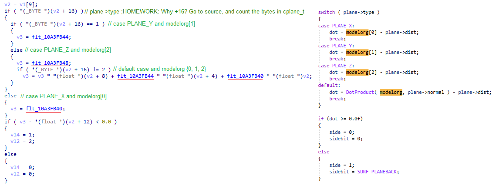

# How to plug-in some C (or C++) code into an existing binary

### Context
As an early engine, idTech2 (Quake2) is doing all it can to draw as few polygons as possible on-screen:
- using frustum culling (skip triangles not in front of the camera)
- and BSP culling (hides triangles not visible from the PC's current position, even if those tris are on the other side of a door in front of us; say hello to unstable hashes).

Since it's already dealing with few triangles, it was not a concern that each drawcall pushes about 2-3 triagles. This is ok in the begining, but it starts to get alot worse when we start disabling culling, and in Heretic, after drawing BSP hidden faces, disabling frustum culling for both brushes and props, Remix was drawing with a cinematic 23-25fps. We're now talking about tens of thousands of drawcalls. BUT, we want more. So ideally we'd put as many related vertex data in a drawcall reducing that number.

### Gameplan
There are two points of interest in the rendering code: drawing brushes, and drawing props, both of which usually have their own rendering path. For Quake2, Heretic2 (and Anachronox) we have:
- RecursiveWorldNode which explores the BSP tree and draws brushes: the geometry clusters are rather random when exploring the tree, so there are multiple texture switches due to this, not to mention that one cluster generates several drawcalls. idTech3, on the other hand, sorts all clusters according to assigned texture, and puts all vertices together in one big DrawCall per texture. If you brain goes 'Wait just 1sec..' it'd be right, but, remember the comment about random order and hidden surface removal? BSP clusters are only a hindrance at this point: we'd need to gather all geometry anyway from the BSP, and find some other way to split it, if we wanted easier Remix replacements (but this is another topic for another day).
- DrawModel (DrawAliasLerpModel) is being called for each prop or PC/NPC; In Q2 there is one texture assigned per model, in H2 there are ~2 for a character so we would have one draw loop for each texture at least (in reality there is one loop for head, torso, hands, legs; then each loop has many drawcalls depending on the no of triangles). That's too many drawcalls, and I'd want to have one drawcall per drawloop.

My plan was the following:
1. replace RecursiveWorldNode in it's entirety, so we have a proper editable playground for brushes;
2. for DrawModel, I only wanted to replace the inner draw loop: let the game assign textures and blending mode, we'd only put all vertices in a big draw buffer and emit one drawcall.
3. these changes I want to do in C(C++) because there will be bugs and debugging, and there will be further changes sine I seem to keep discovering special cases; basically I want to enjoy my life while working on this, and also keep my hair.

> [!TIP]
> ### How do I even find where the relevant code is in these binaries?
> And the short answer is Strings. To help bughunting, developers place error logs in varius locations where unexpected things happened "Error/Warnig array index out of bounds". So one searches for a string containing error or warning.<br>
> Next, that string would usually get passed to a LogPrint (LogError/LogWarn) function. Now that you have the function's adress, label it, and find all the pieces of code that call it (xrefs). The beautiful part: these error messages usually contain the name of the function, so we can label new functions.<br>
One other thing that is human readable in idtech are console variables (or cvars). An example is r_nocull; doing a search for it brings us to the cvar initialisation: Cvar_Get. This function returns a pointer (used by the game to verify it's value, changed status etc), which again can be labelled with the cvar name, and now you'll find references to that pointer all over the code.<br>
> With that clarified, remeber the Six degrees of separation: you will not search for the needle in haystack: search for related things (via xrefs), and each one you find brings you closer to your target: Projection matrix uses FOV and screen size. Those should be near PC world location, and that location with the FOV is used to calculate the frustum etc.<br>
> Things get really easy when you have some sort of source-code.

> [!TIP]
> ### Function Calling Conventions
> This affects how parameters are handed-over to a function to be executed.<br>
> Usually things are simple: all C functions use the _cdecl convention by default, meaning all arguments starting with the last, upto the first, are pushed onto the stack (and the stack grows with each argument pushed). The function is then called with the CALL opcode, and to finish the stack must be brought back to it's size before the call, by subtracting the no. of bytes used for arguments (an int is 32bits, therefore 4 bytes), that's the stack cleanup.<br>
> Windows API (Win32) uses the _stdcall convention, which is very similar, with the exception that the stack cleanup must be performed by the function that receives the parameters -this means that when you replace a _stdcall function, you must match the number of argumets precisely ortherwise you get crashes.<br>
> The last convention is the wild one: the _fastcall convention (let's call it _usercall since there are no hard rules here): some arguments are stored in registers, others on the stack, but usually which arg goes where is consistent throughout the binary. Use the debugger and see which args go into which registers. Normally I'd want to bypass this: create a small 'naked' function that pushes those registers on stack, and then calls your _cdecl function: readability is more important.


> [!IMPORTANT]
> [Source code](https://github.com/whisperglen/QindieGL/blob/master/idtech3_mixup/h2_refgl.cpp) is available in the repo. If context is not clear for some points, feel free to do a quick search!

### Task No.1: RecursiveWorldNode
> [!NOTE]
> This function is executed via CALL opcode. In this section we will look at a code snippet to replace the CALL destination with your C-function, see how to call other functions from the binary, how to access global variables, learn about modifying read-only memory, how to get code and data location in memory, and LittleEndian.

<br>
Above we can see a function's image base offset in ghidra (same thing for variables). How do we get a pointer to those when we begin our hacking? Windows, via Win32 API, will give us something called the **module base address**, or the starting memory location where the exe or dll is loaded. Add ghidra's image base offset to Windows' base adress, job done.<br>
Now you could do it the quick and dirty way: take that hex number in ghidra, cast it to a pointer and just start using it, however sometimes Windows decides to throw a curveball, and it loads your dll or exe at a different address. This would happen when there is a collision (2 dlls need to be loaded at same address) or when something like ASLR is activated for the executable (see [JK2MV](https://github.com/mvdevs/jk2mv)).

<br>
Here I want a dll base address, but if I wanted the main executable, I would pass in NULL as a modulename. The base address is in ref_gl_data.lpBaseOfDll. Add 0xc760 to ref_gl_data.lpBaseOfDll and we have **a function pointer to R_RecursiveWorldNode**. This is how I obtain all other function pointers I'd like to call from the binary. But, if you have a dll that exports those symbols already, there is an easier way: [Creating a lib from a dll](https://coding.hanfling.de/launch/) (search Creating Libs). 

However, I don't want to call R_RecursiveWorldNode. Instead I want to go to the code that calls that function, and modify it to call my newly implemented C-code: ***h2_intercept_RecursiveWorldNode***.

<br>
We're interested in CALL R_RecursiveWorldNode. Make a note of it's offset (0xcbdd). There are 5 bytes here: one byte for the CALL asm-op, and four bytes for a relative address (how many bytes to jump forward or backward, starting from the next address following our CALL asm-op. Basically the CPU takes 0x109ecbe2 (next asm-op) and adds 0xffff67b7, and that is the next address to be executed. But wait, bytes are reversed? Yes, this is what **LittleEndian** means: numeric values or addresses are reversed; if you have a string of `char s[] = "1234"` it is stored in memory as 31 32 33 34 (hex), but if you have a `short m = 5` it is stored as 05 00, or an `int n = 6` it is stored as 06 00 00 00. If you think about it, this is how we do additions and multiplications, the last digit is always used first.

``` c++
byte *code;
intptr_t val;

//R_DrawWorld calls R_RecursiveWorldNode
//e8 7e fb ff ff
code = (byte*)((intptr_t)0xcbdd + (intptr_t)ref_gl_data.lpBaseOfDll);
memcpy( &val, &code[1], 4 );
if ( code[0] == 0xe8 && val == 0xfffffb7e )
{
    //get a relative address to our C function
    val = (intptr_t)h2_intercept_RecursiveWorldNode - (intptr_t)&code[5];

    unsigned long restore;
    if ( VirtualProtect(code, 5, PAGE_EXECUTE_READWRITE, &restore) )
    {
        memcpy( &code[1], &val, sizeof( val ) );
        VirtualProtect(code, 5, restore, NULL);
    }
}
```

Ok so we have the offset, turn that into a pointer, and, just to make sure, we use the pointer to double check it contains the same bytes we obsered in ghidra. Next we are not really allowed to modify those bytes yet: they are marked as executable code, only malware would want to modify, so we must ask Windows to make it writeable (`VirtualProtect`). Once that's done, take the address of our C-code (h2_intercept_RecursiveWorldNode), and subtract from it the memory address following our CALL instruction: &code[5]. The result is copied into &code[1] for the CALL opcode.

First checkpoint reached: our **C-function gets called**. Now let's make sure we can call other functions in the binary, and access globals, and we're done!<br>
If you're guessing we're making use of that base address again, you're right: Function calls are easy, declare them with the proper C function pointer syntax and assign the offset + base address:<br>
``` c++
static image_t* (*R_TextureAnimation)(const mtexinfo_t* tex);// = 0xae70;
R_TextureAnimation = (image_t*(*)(const mtexinfo_t *)) ((intptr_t)0xae70 + (intptr_t)ref_gl_data.lpBaseOfDll);
```
Variables on the other hand, need a bit of explanation. In C we have variables like bytes(chars), shorts, ints, floats, but these are shorthand, there is always a pointer in the background, and the compiler is being helpful dealing with that pointer to make things tidy for us.
1. When the C-code wants to access an int, we need an int pointer, that's what we see in ghidra. The pointer holds the address we see in ghidra, but our code must access the value by using * in front of the pointer. I've declared my own shorthand for this.
``` c++
static int* dp_r_framecount = (int*)((intptr_t)0x5fd20 + (intptr_t)ref_gl_data.lpBaseOfDll);;
#define r_framecount (*dp_r_framecount)
```
 [ ABC ] means the value at address ABC <br>

2. Arrays of values are easier to declare and use, since they are pointers already. But you need to spot them first in the assembly: they have adjacent memory addresses.
``` c++
static float* modelorg;// = 0x5fb40;
```
<br>

3. But in case the binary uses a pointer to an array: e.g. `int *array_of_ints = malloc(10 * sizeof int)`, the asm code will too use a pointer: the address where that malloc'ed value is stored; that is a double pointer, and in this case I'm using the same shorthand I used for simple ints.
``` c++
//this is a global pointer that holds the address of an element in an array of structs (the entities)
int **dp_currententity;// = 0x5fe7c
#define currententity (*dp_currententity)
//this is in fact currententity->flags, but is was easier to copy the array subscript from ghidra, than
//  declaring all fields from that struct
if ( (currententity[0xc] & 8) != 0 ) //check if FULLBRIGHT
{
    vb->clr.all = 0xffffffff;
    render_flags = 0;
}
```
 [ ABC ] means the value at address ABC <br>
Feeling confused? Remember there is always an address, so each time you look at a global in asm ask yourself: is this the address or the value?

One last thing before finishing with  R_RecursiveWorldNode: the game will sometimes use a big struct, that contains lots of fields, and other structs etc. we call it Composition. The compiler will usually use the starting address for that big struct (parent), but it wil sometimes choose to calculate an absolute address for the contained fields, just to make it easier to access them. Check ***r_newrefdef.areabits***, here compiler decides to use a direct address to ***areabits***, and not offset that field from the parent (***r_newrefdef***).
``` c++
// Check for door connected areas
if ( /*r_newrefdef.areabits*/r_newrefdef_areabits )
{
    if (! (/*r_newrefdef.areabits*/r_newrefdef_areabits[pleaf->area>>3] & (1<<(pleaf->area&7)) ) )
        return;		// not visible
}
```

That, to me was really cool: Unlimited Power! Wrote C-code and executed it, called other function present in the binary, and accessed globals, without requiring lib to provide these missing symbols.

### Task No.2: DrawModel
> [!NOTE]
> When modifying DrawModel you will learn about: register clobbering, and calling a function by absolute address.

Great, let's do some Refactor: Extract Method, but with asm. This is a good way to avoid figuring out some of the function and global offsets we needed for RecursiveWorldNode, if you can restrict you changes to a small potion of the code. You might be able to use this trick in case you decided to do some binary patching i.e. overwriting some asm, but you do not have enough space for the overwrite; call a new function and implement all the extra code there.

> [!TIP]
> ### Register clobbering
> We know each function must do work, and that is done with registers, think of them as a board you can write on, and wipe clean.<br>
> The board needs to be shared by all functions, but not all functions need the whole board. So there are some rules set in place: when inside a function call, a part of the board is free to be used without restrictions, but when more space is needed, those parts must be written to stack, and restored when the function finishes.<br>
> The freely useable registers (clobbered registeres) are: EAX, ECX, EDX, EBP.<br>
> When I want to call a function, and I still need that data in the freely useable registers, I must to save them before the call (I have to guarantee that free usage to the called function). The called function will then take care to restore the rest of the registers.

In order to call a new C function, I need to write some asm code: an adapter. I will prepare a different C function with the asm intructions to push arguments on stack, perform the call, do stack cleanup, and jump over unnecessary code (there is unused asm code is the old function that should be skipped over).<br>
Then at runtime, I want to memcopy the generated bytecode at the desired location. There is one problem though, the CALL opcode uses a relative address, and if I move this asm code to a different address, that relative call will not be right.<br>
I need an absolute address. I realized that a variable that holds a function pointer, it has an absolute address. Therefore I will declare a function pointer variable, store the address of my DrawModel C function, and in the adapter I will CALL to this function pointer. The generated CALL opcode, will first fetch the data in the variable (the function pointer) and then execute the code at that address.
``` c++
static void R_MeshBuildVertexBufferAndDraw( int* order, float *normals_array );
static void (*fp_MeshBuildVertexBuffer)(int* order, float *normals_array) = R_MeshBuildVertexBufferAndDraw;

static __declspec(naked) void h2_bridge_to_MeshBuildVertexBuffer()
{
	__asm {
		lea edx,[ESP + 0x30] //normals_array, resides on stack, hence using ESP
		push edx //push normals as the 2nd argument
		push edi //push order as the 1st argument, already available in EDI

		call fp_MeshBuildVertexBuffer
		add esp,8 //stack cleanup

		//placeholder where we're placing a jmp to end of loop
        // the destination is relative and must be calculated at runtime
		nop
		nop
		nop
		nop
		nop
	}
}
```
Let's now look at the setup code:
``` c++
unsigned long restore;
//GL_DrawFlexFrameLerp draws the vertices				
//8b 2f 83 c7 this is where the draw loop starts
code = PTR_FROM_OFFSET( byte*, 0x28ab );
memcpy( &val, &code[0], 4 );
if ( val == 0xc7832f8b ) //doublechecking we have the right offsets
{
    if ( hook_unprotect( code, 471, &restore ) ) //Make memory writeable, 471 from original code needs to be replaced or skipped
    {
        //copy our asm bridge code over
        byte* src = (byte*)h2_bridge_to_MeshBuildVertexBuffer;
        int nopcnt = 0; //used to detect that chain of 5 nops in the asm
        int i = 0;
        while (i < 471)
        {
            code[i] = src[i];

            if ( code[i] == 0x90 )
                nopcnt++;
            else
                nopcnt = 0;

            i++;

            if ( nopcnt >= 5 )
                break;
        }

        if ( nopcnt == 5 )
        {
            //now that we reached the nop instructions, make a jmp over the replaced code (the draw loop)
            byte* endcall = PTR_FROM_OFFSET( byte*, 0x29d6 ); //this is the end of the draw loop
            val = endcall - &code[i];
            code[i-5] = 0xe9; //jmp relative
            memcpy( &code[i-4], &val, 4 );

            logPrintf( "h2_refgl_init:GL_DrawFlexFrameLerp was patched\n" );
        }

        hook_protect( code, 471, restore );
    }
}
```