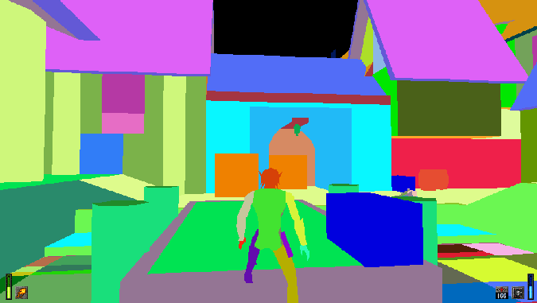

# How to plug-in some C (or C++) code into an existing binary

## Context
As an early 3D engine, idTech2 (Quake2) is doing all it can to draw as few polygons as possible on-screen:
- using frustum culling (skip triangles not in front of the camera)
- and BSP culling (hides triangles not visible from the PC's current position, even if those tris are on the other side of a door in front of us; say hello to unstable hashes).

Since it's already dealing with few triangles, it was not a concern that each drawcall pushes about 2-3 triagles. This is ok in the begining, but it starts to get alot worse when we start disabling culling, and in Heretic, after drawing BSP hidden faces, disabling frustum culling for both brushes and props, Remix was drawing with an unplayable 15-25fps. We're now talking about tens of thousands of drawcalls. BUT, We want more! So ideally we'd put as many related vertex data in a drawcall reducing that number.

## Gameplan
There are two points of interest in the rendering code: drawing brushes, and drawing props, both of which usually have their own rendering path. For Quake2, Heretic2 (and Anachronox) we have:
- RecursiveWorldNode which explores the BSP tree and draws brushes: the geometry clusters are rather random when exploring the tree (i.e. they do not draw complete objects, rather a small part here, another there), so there are multiple texture switches due to this, not to mention that one cluster generates several drawcalls. idTech3, on the other hand, sorts all clusters according to assigned texture, and puts all vertices together in one big DrawCall per texture. If you brain goes 'Wait just 1sec..' it'd be right, Remix replacement for meshes just got complicated, but, remember the comment about random order and hidden surface removal? We need all the data from all clusters to obtaing complete objects and prevent light leaking. BSP clusters are only a hindrance at this point. There might be a way to split the brushes again, based on proximity, i.e. have contiguous brushes, then cull the far away ones (but this is another topic for another day).
- DrawModel (GL_DrawFlexFrameLerp) is being called for each prop or PC/NPC; In Q2 there is one texture assigned per model, in H2 there are ~2 for a character so we would have one draw loop for each texture at least (in reality there is one loop for head, torso, hands, legs; then each loop has many drawcalls depending on the no of triangles). That's too many drawcalls, and I'd want to have one drawcall per drawloop.

My plan was the following:
1. replace RecursiveWorldNode in it's entirety, so we have a proper editable playground for brushes; first we'd draw hidden faces (no cull), we can disable lightmaps at this point (disable multitexture and don't supply 2nd TexCoords sample), we can skip alpha surfaces if they are hidden (they are independent and shouldn't affect hashes) etc
2. for DrawModel, I only wanted to replace the inner draw loop: let the game assign textures and blending mode, we'd only put all vertices in a big draw buffer and emit one drawcall.
3. these changes I want to do in C(C++) because there will be bugs and debugging, and there will be further changes since I keep discovering special cases; basically I want to enjoy my time while working on this, and also keep my hair.

Sneakpeak: Before and After<br>



> [!TIP]
> ### How do I even find where the relevant code is in these binaries?
> - And the short answer is Strings. To help bughunting, developers place error logs in various locations in the code e.g. "Error/Warnig array index out of bounds". So one searches for a string containing error or warning.<br>
> - Next, that string gets passed to a LogPrint (LogError/LogWarn) function. Label the function address, and find all the pieces of code that call it (xrefs). The beautiful part: these error messages usually contain the name of the function they are in, so we can label new functions.<br>
> - One other thing that is human readable in idtech are console variables (or cvars). An example is r_nocull; doing a search for it brings us to the cvar initialisation: Cvar_Get. This function returns a pointer (used by the game to verify it's value, changed status etc), which again can be labelled with the cvar name, and now you'll find references to that pointer all over the code.<br>
> - Remeber the Six degrees of separation: you will not search for the needle in haystack: search for related things (via xrefs), and each one you find brings you closer to your target: Projection matrix uses FOV and screen size. Those should be near PC world location, and that location with the FOV is used to calculate the frustum. Camera and World matrix gets passed to SetTransform(DX9)/LoadMatrixf(OGL) etc.<br>

> [!TIP]
> ### Function Calling Conventions [^2]
> - This affects how parameters are handed-over to a function to be executed.<br>
> - All C functions use the _cdecl convention by default, meaning all arguments starting with the last, upto the first, are pushed onto the stack (and the stack 'grows' with each argument pushed). The function is then called with the CALL opcode, and to finish the stack must be brought back to it's size before the call, by removing the no. of bytes used for arguments (an int is 32bits, therefore 4 bytes), that's the stack cleanup.<br>
> - Windows API (Win32) uses the _stdcall convention, which is very similar, with the exception that the stack cleanup must be performed by the function that receives the parameters -this means that when you replace a _stdcall function, you must match the number of argumets precisely ortherwise you get crashes.<br>
> - The last convention is the wild one: the _fastcall convention (let's call it _usercall since I've seen the rules broken, *Intel Compiler, cough*): some arguments are stored in registers, others on the stack, but usually which arg goes where is consistent throughout the binary. Use the debugger and see which args go into which registers. Normally I'd want to bypass this: create a small 'naked' function that pushes those registers on stack, and then calls your _cdecl function: readability is more important.[^6]
> - One more 'weird' thing, the stack works backwards: like a reverse loading bar filling from the right; when argumets get pushed, it goes from 100 to 96, 92. Therefore stack cleanup adds the number of bytes consumed, bringing it to 100 again.


> [!IMPORTANT]
> [Source code](https://github.com/whisperglen/QindieGL/blob/master/idtech3_mixup/h2_refgl.cpp) [^1] is available in the repo. If context is not clear for some points, feel free to do a quick search!

## Task No.1: RecursiveWorldNode
> [!NOTE]
> This function is executed via CALL opcode. In this section we will look at a code snippet to replace the CALL destination with a C-function, see how to call other functions from the binary, how to access global variables, modifying read-only memory, how to get code and data location in memory, and LittleEndian.

<br>
Above we can see a function's image base offset in ghidra (same thing for variables). How do we get a pointer to those when we begin our hacking? Windows, via Win32 API, will give us something called the **module base address**, or the starting memory location where the exe or dll is loaded. Add ghidra's image base offset to Windows' base adress, job done.<br>
Now you could do it the quick and dirty way: take that hex number in ghidra, cast it to a pointer and just start using it, however sometimes Windows decides to throw a curveball, and it loads your dll or exe at a different address. This would happen when there is a collision (2 dlls need to be loaded at same address) or when something like ASLR is activated for the executable (see [JK2MV](https://github.com/mvdevs/jk2mv)).

<br>
Here I want a dll base address, but if I wanted the main executable, I would pass in NULL as a modulename. The base address is in ref_gl_data.lpBaseOfDll. Add 0xc760 to ref_gl_data.lpBaseOfDll and we have a function pointer to R_RecursiveWorldNode (see an actual example later). However, it's not R_RecursiveWorldNode that I want to call.

### First step: I want to go to the code that calls that function, and modify it to call my newly implemented C-code: _h2_intercept_RecursiveWorldNode_.

<br>
We're interested in this line: CALL R_RecursiveWorldNode. Make a note of it's offset (0xcbdd). There are 5 bytes here: one byte for the CALL asm-op, and four bytes for a relative address (how many bytes to jump forward or backward, starting from the next address following our CALL asm-op. Basically the CPU takes 0x109ecbe2 (next asm-op) and adds 0xffff67b7, and that is the next address to be executed. But wait, bytes are reversed? Yes, this is what **LittleEndian** means: numeric values or addresses are reversed; if you have a string of `char s[] = "1234"` it is stored in memory as 31 32 33 34 (hex), but if you have a numeric value e.g. a `short m = 5` it is stored as 05 00, or an `int n = 6` it is stored as 06 00 00 00. If you think about it, this is how we do additions and multiplications, the last digit is always used first.

``` c++
byte *code;
intptr_t val;

//R_DrawWorld calls R_RecursiveWorldNode
//e8 7e fb ff ff
code = (byte*)((intptr_t)0xcbdd + (intptr_t)ref_gl_data.lpBaseOfDll);
memcpy( &val, &code[1], 4 );
if ( code[0] == 0xe8 && val == 0xfffffb7e )
{
    //get a relative address to our C function
    val = (intptr_t)h2_intercept_RecursiveWorldNode - (intptr_t)&code[5];

    unsigned long restore;
    if ( VirtualProtect(code, 5, PAGE_EXECUTE_READWRITE, &restore) )
    {
        memcpy( &code[1], &val, sizeof( val ) );
        VirtualProtect(code, 5, restore, NULL);
    }
}
```

Now that we have the offset where we want to plug-in our code (0xcbdd), turn it into a pointer (code), and, just to make sure, we use the pointer to check it actually contains the same bytes we obsered in ghidra (code[0] && val). But we are not really allowed to modify those bytes yet: they are marked as executable code (malware protection), so we must ask Windows to make it writeable (`VirtualProtect`). Once that's done, take the address of our C-code (h2_intercept_RecursiveWorldNode), and subtract from it the memory address following our CALL instruction: &code[5]. The result is copied into &code[1] for the CALL opcode.

### Second step: Call other functions in the binary
If you're thinking we're making use of that base address again, you're right: function calls are easy, declare them with the proper C function-pointer syntax and assign the offset + base address:<br>
``` c++
static image_t* (*R_TextureAnimation)(const mtexinfo_t* tex);// = 0xae70;
R_TextureAnimation = (image_t*(*)(const mtexinfo_t *)) ((intptr_t)0xae70 + (intptr_t)ref_gl_data.lpBaseOfDll);
```
NOTE: To tranform a function declaration into a function-pointer, you place a * in front of the name, then wrap that in (), like this: (*FunctionName). Same thing when cast-ing to a function-pointer.<br>
This is how I obtain all other function pointers I'd like to call from the binary. But, if you have a dll that exports those symbols already (rare but luucky!), there is an easier way, see [^3].

### Third step: Access globals
Variables on the other hand, need a bit of explanation. In C we have variables like bytes(chars), shorts, ints, floats, but this is just shorthand: there is always a pointer in the background, and the compiler is being helpful dealing with that pointer to make things tidy for us.
1. When the C-code wants to access an int, we need an int pointer. That pointer holds the address we see in ghidra, and our code will access the value by using * . I've declared my own shorthand to make it similar to accessing an int:
``` c++
static int* dp_r_framecount = (int*)((intptr_t)0x5fd20 + (intptr_t)ref_gl_data.lpBaseOfDll);
#define r_framecount (*dp_r_framecount)
```
 [ ABC ] means the value at address ABC <br>

2. Arrays of values are easier to declare and use, since they are pointers already. But you need to spot them first in the assembly; hint: they have adjacent memory addresses.
``` c++
static float* modelorg;// = 0x5fb40;
```
<br>

3. But in case the binary uses a pointer to an array: e.g. `int *array_of_ints = malloc(10 * sizeof int)`, the asm code will too use a pointer: the address where that malloc'ed value is stored; that is a double pointer, and in this case I'm using the same shorthand I used for simple ints.
``` c++
//this is a global pointer that holds the address of an element in an array of structs (the entities)
byte **dp_currententity;// = 0x5fe7c
#define currententity (*dp_currententity)
// currententity[0x30] is currententity->flags (a byte), but is was easier to copy
//  the array subscript from ghidra, than declaring the struct
if ( (currententity[0x30] & 8) != 0 ) //check if FULLBRIGHT
{
    vb->clr.all = 0xffffffff;
    render_flags = 0;
}

//HOMEWORK: what if we need to access int fields from currententity ? [^7]
```
 [ ABC ] means the value at address ABC <br>
Feeling confused? Remember there is always an address, so each time you look at a global in asm ask yourself: is this the address or the value?

### Optional step: More about global variables
One last thing before finishing with  R_RecursiveWorldNode: the game will sometimes use a big struct, that contains lots of fields, other structs etc. we call it Composition. The compiler will usually use the starting address for that big struct (the parent), but sometimes it will choose to calculate an absolute address for the contained fields, just to make it easier to access them. Check ***r_newrefdef.areabits***, here compiler decides to use a direct address to ***areabits***, and not offset that field from the parent ***r_newrefdef*** (that would have meant: take the address of the parent, add the offset of areabits, then add another offset to index the areabits array).
``` c++
// Check for door connected areas
if ( /*r_newrefdef.areabits*/r_newrefdef_areabits )
{
    if (! (/*r_newrefdef.areabits*/r_newrefdef_areabits[pleaf->area>>3] & (1<<(pleaf->area&7)) ) )
        return;		// not visible
}
```

*Job done!* That, to me, was really cool: Unlimited Power! Wrote C-code and executed it, called other functions present in the binary, and accessed globals, all this without requiring lib to provide these missing symbols.

## Task No.2: DrawModel
> [!NOTE]
> When modifying DrawModel you will learn about: register clobbering, and calling a function by absolute address.

Great, let's do some [Refactor: Extract Method](https://learn.microsoft.com/en-us/visualstudio/ide/reference/extract-method), but with asm. With this method I don't have to figure out the function and global addresses I needed for RecursiveWorldNode, or figure out many other operations done by the game (choosing textures, blending modes). You might be able to use this trick in case you decided to do some binary patching i.e. overwriting some asm, but you do not have enough space for the overwrite; call a new function and implement all the extra code there.<br>
But, this change is tricky and has more things that can go wrong; it needs more attention than the other method.

> [!TIP]
> ### Register clobbering
> - We know each function must do work, and that is done using registers, think of them as a board you can write on, and wipe clean.<br>
> - The board needs to be shared by all functions, but not all functions need the whole board. So there are some rules set in place: when inside a function call, a part of the board is free to be used without restrictions, but when more space is needed, those parts must be written to stack, and restored when the function finishes.<br>
> - The freely useable registers (clobbered registeres) for Windows x86 are: EAX, ECX, EDX.<br>
> - When I want to call a function, and I still need the data in the freely useable registers, I must to save them before the call (I have to guarantee that 'free usage' to the called function). The called function will then take care to restore the rest of the registers.
> - One more thing, which I did not encounter, is that the [old floating-point stack](https://en.wikibooks.org/wiki/X86_Assembly/Floating_Point) must also be empty before a call. In modern compiled C-code, old FP instructions and registers are not used, they are superseeded by SSE and AVX, so using floating-point in your code might not interfere w/ the old stack. However if crashes start knocking, check if FP stack is to blame [^5]

1. In order to call a new C function, I will write an asm adapter in the C/C++ source file:
    - to push arguments on stack: these are usually local variables that I need access to in my C function, but they can also be globals
    - perform the call
    - do stack cleanup
    - jump over unnecessary code (there is unused asm code is the old function that should be skipped over)
2. Then at runtime, I want to memcopy the generated bytecode at the desired location.

### Step one: The ASM adapter
TODOs are clear, however there is one problem: the CALL opcode uses a relative address, and if I move this asm code to a different location, that relative call will not be right. I need an absolute address for it!<br>
My first idea was to use a function-pointer global variable, pointing at my DrawModel replacement, and use CALL on that function pointer. But upon further googling I discovered I can actually copy the address of DrawModel to a register, and use CALL on that register:
``` c++
// DrawModel replacement (replaces a block inside DrawModel using Extract Method concept)
static void R_Model_BuildVBuffAndDraw( int* order, float *normals_array );

static __declspec(naked) void h2_bridge_to_Model_BuildVBuff()
{
    __asm {
        // save the clobbered registers
        push eax
        push ecx
        push edx

        lea edx,[ESP + 0x30 + 0xc] //normals_array, resides on stack, hence using ESP
        // from ghidra I deduced normals_array is at ESP + 0x30, but I already pushed 3 values
        // which means I need to add 0xc
        push edx //push normals as the 2nd argument
        push edi //push order as the 1st argument; was already present in EDI

        mov eax, R_Model_BuildVBuffAndDraw
        call eax
        add esp,8 //stack cleanup

        //restore clobbered registers, in reverse order
        pop edx
        pop ecx
        pop eax

        //placeholder where we're placing a jmp to end of loop
        // the destination is relative and must be calculated at runtime
        nop
        nop
        nop
        nop
        nop
    }

    // NOTE: if low on space, check the clobbered registers,
    //  sometimes the code restores them each loop, and you might not have to save them, #YOLO
}
```
OK, but what asm code should I put in my adaptors? Try to write it in C first, compile & dissassemble it, and check the opcodes. Or use an online compiler that shows asm: [^4]
### Step two: Runtime setup
Now, at runtime there is a bit of setup to do. This adapter that I wrote, it is smaller in size than the replaced/'Extracted' code, therefore I will have to skip over that unnecessary code with a jump. For that I have placed some NOP markers, which I need to replace with a JMP instruction. Let's see:
``` c++
unsigned long restore;
//GL_DrawFlexFrameLerp draws the vertices				
//8b 2f 83 c7 this is where the draw loop starts
code = PTR_FROM_OFFSET( byte*, 0x28ab );
memcpy( &val, &code[0], 4 );
if ( val == 0xc7832f8b ) //doublechecking we have the right offset
{
     //Make memory writeable, 471 from original code needs to be replaced or skipped
    if ( hook_unprotect( code, 471, &restore ) )
    {
        //copy our asm bridge code over
        byte* src = (byte*)h2_bridge_to_Model_BuildVBuff;
        int nopcnt = 0; //used to detect that chain of 5 nops in the asm
        int i = 0;
        while (i < 471)
        {
            code[i] = src[i];

            if ( code[i] == 0x90 )
                nopcnt++;
            else
                nopcnt = 0;

            i++;

            if ( nopcnt >= 5 )
                break;
        }

        if ( nopcnt == 5 )
        {
            //now that we reached the nop instructions, make a jmp over the replaced code (the draw loop)
            byte* endcall = PTR_FROM_OFFSET( byte*, 0x29d6 ); //offset for the end of the draw loop
            val = endcall - &code[i];
            code[i-5] = 0xe9; //jmp relative
            memcpy( &code[i-4], &val, 4 );

            logPrintf( "h2_refgl_init:GL_DrawFlexFrameLerp was patched\n" );
        }

        hook_protect( code, 471, restore );
    }
}
```
## Closing Words
I started to modify original Quake2 source for Remix, because I hoped I could port it to Heretic2. I had no idea if it was possible. It was a long shot, that, at least was clear. But little by little, ideas popped-up. I tried them, debugged, made them work. Did I mention the game crashes when loading a savegame -rough. Saving grace is that there are sources (Q2, some RE projects on github, and H2 gamecode was open-sourced).<br>
In the end I'm pretty satisfied with how it went, I was even able to drop stuff from the drawcall, like the lightmaps, change vertex colors, add normals for vertexes.<br>
Not to mention, that with Detours I'm intercepting LoadMap calls (I could have specific rtx.conf setting for each map, like RTCW), and RenderFrame (turn dynamic light data for special effects into RemixLights).<br>
Hopefully this gives you some ideeas of your own!<br>

## References
[^1]: Source code: https://github.com/whisperglen/QindieGL/blob/master/idtech3_mixup/h2_refgl.cpp<br>
[^2]: Calling Conventions Demystified: https://www.codeproject.com/Articles/1388/Calling-Conventions-Demystified<br>
[^3]: Creating a lib from a dll (search for: Creating Libs): https://coding.hanfling.de/launch/<br>
[^4]: Online compiler that shows asm: https://godbolt.org/<br>
[^5]: FP registers before CALL [wiki](https://en.wikipedia.org/wiki/X86_calling_conventions#cdecl) and how to [pop FP registers](https://stackoverflow.com/questions/4772389/simplest-way-to-remove-something-from-the-fpu-stack)<br>
[^6]: Transforming a [_usercall (intel's version of _fastcall) into _cdecl](https://github.com/whisperglen/QindieGL/blob/23634e1547f9a33c4d5b903d3e3bae1b860cf07d/idtech3_mixup/surface_sorting.cpp#L185)<br>
[^7]: Use an int pointer, and divide the index by 4 (asm always uses bytes). Or, still use the byte ptr, and memcopy 4 bytes to an int variable