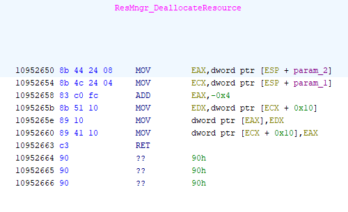
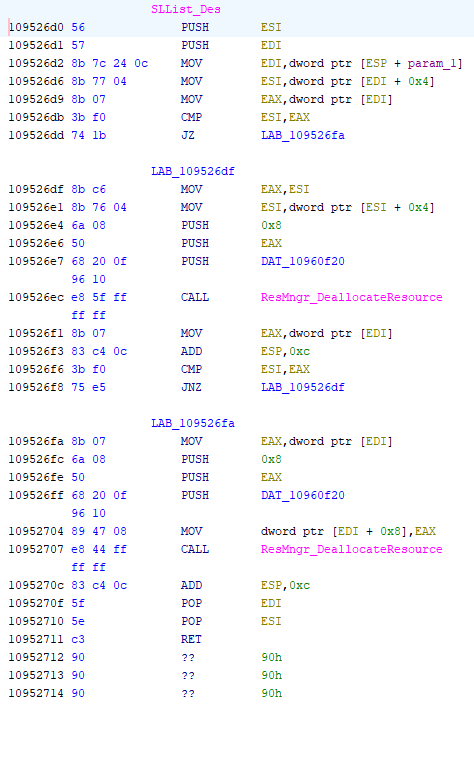

### Problem
1. I have caught crashes in the debugger where the issue was ResMngr_DeallocateResource was getting a null pointer, and it tried to write to that address. There should have been a nullcheck there.<br>
2. ResMngr_DeallocateResource was called by SLList_Des, which upon further inspection might deallocate resources twice. I want to set those resources to null after they are deallocated, so that we can avoid possible double free.

These changes I will do by modifying the dll in a hex editor, since there is extra space after each method where I can move some bytes over and type in new ones.

### ResMngr_DeallocateResource
C code:
``` patch
void ResMngr_DeallocateResource( ResourceManager_t *resource, void *toDeallocate, size_t size )
{
	char **toPush;

+	if ( toDeallocate ) // Check for NULL
+	{
		toPush = (char **)(toDeallocate)-1;

		*toPush = (char *)(resource->free);

		resource->free = toPush;
+	}
}
```
The changes are two lines added after param_2 is read into EAX: test for zero, and jump if true to the end (10952654):<br>
 

This is how the disassembled code looks:<br>


### SLList_Des
C code:
``` patch
void SLList_Des(SinglyLinkedList_t* this_ptr)
{
	SinglyLinkedListNode_t* node = this_ptr->front;
	while (node != this_ptr->rearSentinel)
	{
		SinglyLinkedListNode_t* next = node->next;
		ResMngr_DeallocateResource(&res_mgr, node, 8);
		node = next;
	}

-	this_ptr->current = this_ptr->rearSentinel;
	ResMngr_DeallocateResource(&res_mgr, this_ptr->rearSentinel, 8);
+	this_ptr->front = this_ptr->current = this_ptr->rearSentinel = NULL; //set them all to NULL since they are deallocated
}
```
The changes are 3 nops before last call to ResMngr_DeallocateResource (10952704), then 4 lines after the call, where zero is assigned to the three members (1095270f):<br>
 

This is how the disassembled code looks:<br>

